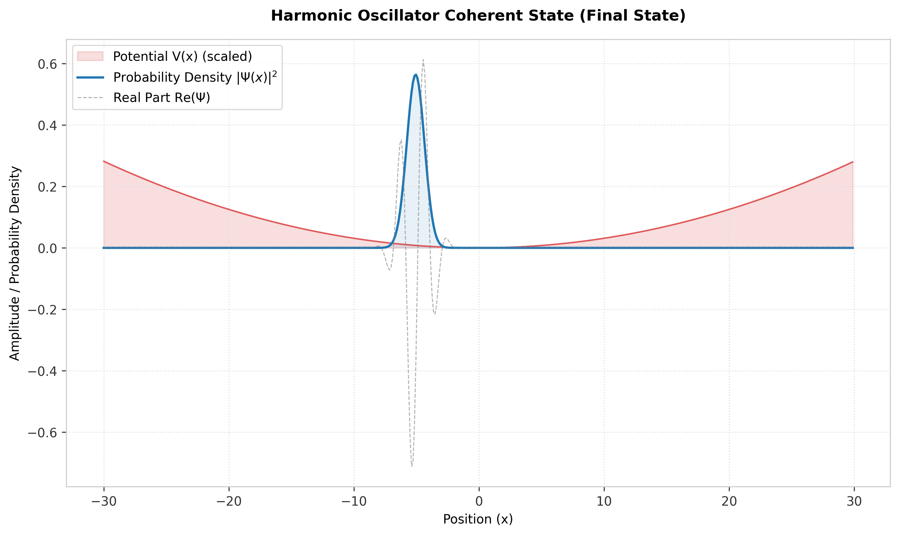
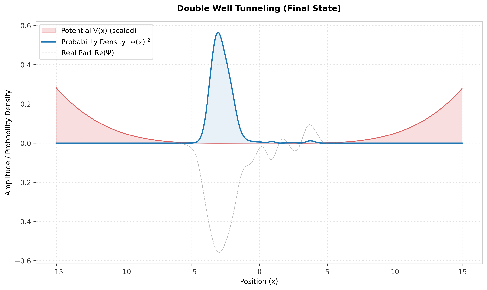
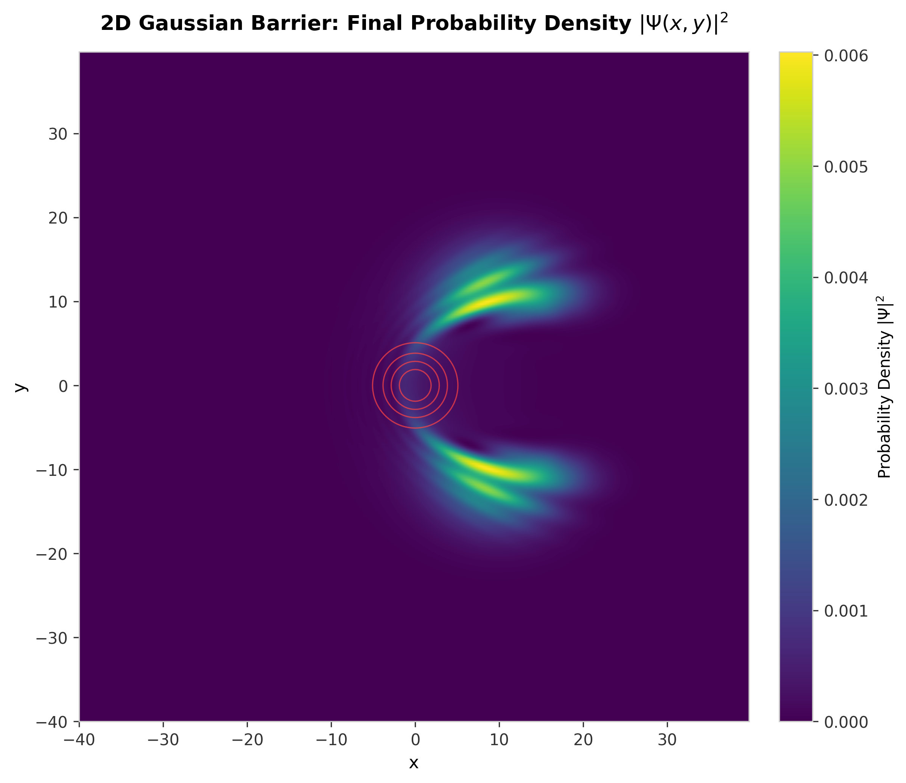
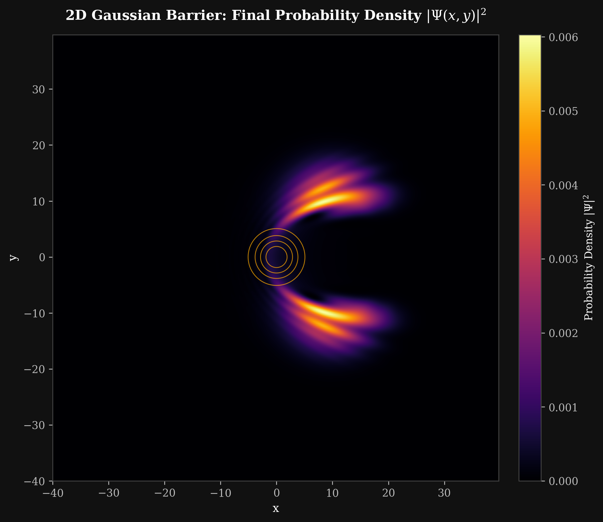
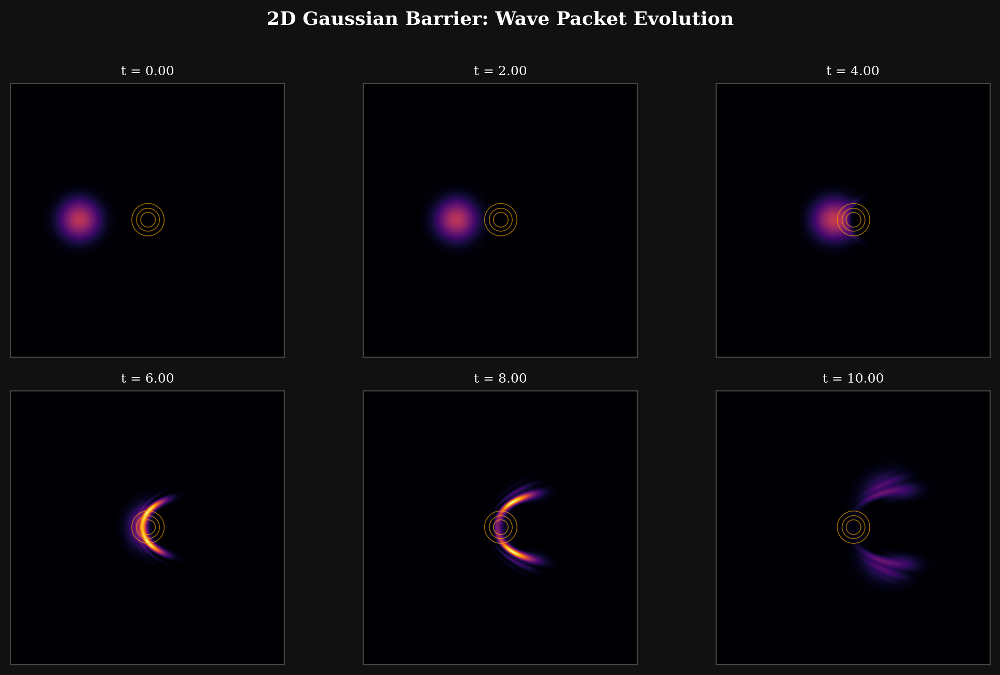
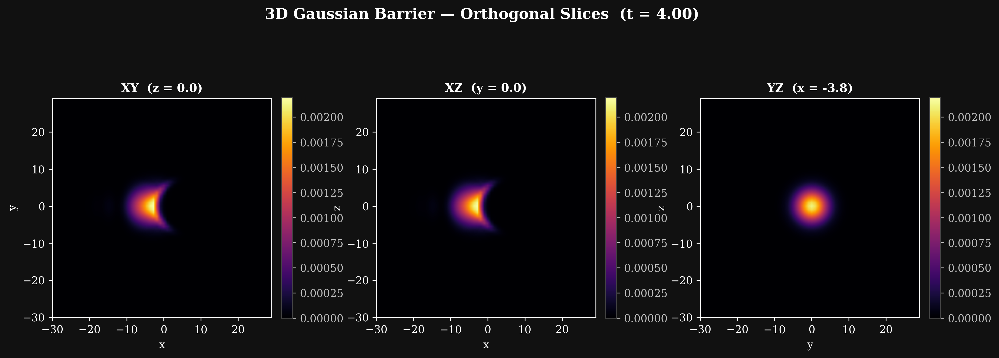
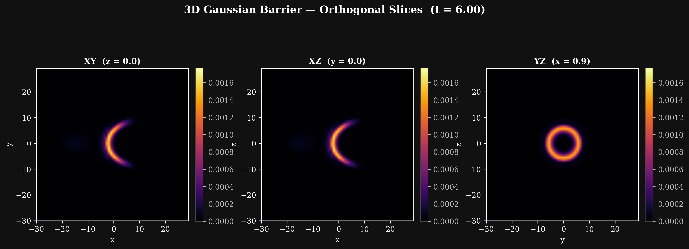

# QuantumLab: Research-Grade Quantum Simulation Framework

A high-performance, modular Python library for numerical quantum mechanics simulations. QuantumLab solves the Time-Dependent Schrödinger Equation (TDSE) in **1D, 2D, and 3D** using the Split-Step Fourier Method (SSFM) to model quantum wave packet dynamics with high physical fidelity.

---

## Key Features

- **Multi-Dimensional Unitary Solvers**: High-precision split-step solvers in **1D, 2D, and 3D** that conserve total probability norm to machine precision (< 10⁻¹²).
- **Physical Observables Module**: Real-time evaluation of expectation values (⟨x⟩, ⟨p⟩, ⟨E⟩, ⟨T⟩, ⟨V⟩) and quantum uncertainties (Δx, Δp) proving Heisenberg's uncertainty principle.
- **Modular Potential Registry**:
  - **Barriers**: Gaussian (1D/2D/3D), Rectangular, Step, Multiple, and Resonant Tunneling Diodes (RTD).
  - **Wells**: Infinite Square Well, Finite Square Well, and quartic Double Well.
  - **Oscillators**: Harmonic Oscillator.
  - **Periodic**: Sine-squared lattice (Crystal Potential).
  - **Disorder**: Cell-based random potential for Anderson localization.
  - **Custom**: User-defined Python callable functions.
- **Absorbing Boundary Layer (ABL)**: Prevents artificial reflections at domain edges in all dimensions.
- **Aesthetic Plotting**: Publication-ready scientific plotting with LaTeX markup, custom typography, light/dark themes, and dual-space (position and momentum side-by-side) analyses.
- **2D Visualization**: Probability density heatmaps, snapshot grids, and orthogonal slices for 3D wavefunctions.
- **3D Space-Time Rendering**: Premium 3D surface visualizations of 1D probability density evolution over time.

---

## Architecture

```
quantumlab/
├── core/
│   ├── grid.py              # Grid1D, Grid2D, Grid3D — discretized spatial domains
│   ├── wavefunction.py      # WaveFunction1D/2D/3D — state representation
│   └── absorbing_boundary.py  # Absorbing Boundary Layer (ABL)
├── solvers/
│   ├── split_step_1d.py     # 1D Split-Step Fourier solver
│   ├── split_step_2d.py     # 2D Split-Step Fourier solver
│   ├── split_step_3d.py     # 3D Split-Step Fourier solver (CPU/SciPy)
│   └── split_step_3d_gpu.py # 3D SSFM with CuPy GPU acceleration + CPU fallback
├── potentials/
│   ├── base.py              # Abstract Potential base class
│   ├── barriers.py          # Gaussian (1D/2D/3D), Rectangular, Step, Multiple, RTD
│   ├── wells.py             # InfiniteSquareWell, FiniteSquareWell, DoubleWell
│   ├── oscillator.py        # HarmonicOscillator
│   ├── periodic.py          # CrystalPotential
│   ├── disorder.py          # RandomDisorder
│   └── custom.py            # CustomPotential (user-defined callable)
├── observables/
│   ├── expectation.py       # Position, momentum, energy expectation values & uncertainties
│   ├── coefficients.py      # Transmission & reflection coefficients
│   └── momentum.py          # Momentum-space wavefunction
├── visualization/
│   ├── plots_1d.py          # 1D wavefunction & dual-space plots
│   ├── plots_2d.py          # 2D density heatmaps, snapshots, orthogonal 3D slices
│   ├── plots_3d.py          # 3D space-time surface rendering
│   ├── animation.py         # Time-evolution animation exporter (MP4/GIF)
│   └── style.py             # Theme management (light/dark)
├── config.py                # Default config loader (YAML-based)
├── constants.py             # Physical constants (atomic units)
└── runner.py                # HPC batch simulation runner (YAML-driven)
```

---

## Example Gallery

The framework includes 6 pre-built simulation scripts under the `examples/` directory. Run any example to generate high-quality scientific visualizations saved to the `output/` directory.

---

### 1. Gaussian Barrier Scattering (`examples/01_gaussian_barrier.py`)

Propagates a 1D wave packet towards a Gaussian potential barrier, resolving reflection (*R*) and transmission (*T*) coefficients with R + T = 1.000000 conservation.

**Final State Plot:**


**3D Space-Time Surface:**


**Dual Space Analysis (Position & Momentum):**


---

### 2. Harmonic Oscillator (`examples/02_harmonic_oscillator.py`)

Simulates a coherent state wave packet oscillating back and forth in a parabolic well, demonstrating exact total energy conservation (fractional drift < 10⁻⁵).

**Final State Plot:**


**3D Space-Time Surface:**


---

### 3. Double Well Tunneling (`examples/03_double_well.py`)

Illustrates quantum tunneling and wave packet oscillations between two symmetric quartic wells separated by a central potential barrier.

**Final State Plot:**


**3D Space-Time Surface:**


---

### 4. Multiple Barrier Scattering (`examples/04_multiple_barriers.py`)

Models wave packet splitting and high-frequency interference fringes as the packet scatters off multiple rectangular barriers.

**Final State Plot:**


**3D Space-Time Surface:**


**Dual Space Analysis:**


---

### 5. 2D Gaussian Barrier Scattering (`examples/05_2d_gaussian_barrier.py`)

A 2D Gaussian wave packet scatters off an isotropic radially-symmetric Gaussian barrier on a 256×256 grid. Demonstrates 2D quantum diffraction with a heatmap of final probability density and a 6-panel snapshot grid showing the full wave packet evolution.

**Final Probability Density (Light Theme):**


**Final Probability Density (Dark Theme):**


**Wave Packet Evolution Snapshots:**


---

### 6. 3D Gaussian Barrier Scattering (`examples/06_3d_gaussian_barrier.py`)

A 3D Gaussian wave packet propagates through a spherical Gaussian barrier on a 64³ grid. Orthogonal slice plots (XY, XZ, YZ planes) visualize the 3D probability density at multiple timesteps.

**Orthogonal Slices at t = 2.00 (Step 100):**


**Orthogonal Slices at t = 4.00 (Step 200):**


**Orthogonal Slices at t = 6.00 (Step 300):**


---

## Installation & Usage

### 1. Install Dependencies

Install QuantumLab in development/editable mode (requires Python ≥ 3.9):

```bash
pip install -e .
```

**Core dependencies** (installed automatically):
- `numpy >= 1.22`
- `scipy >= 1.8`
- `matplotlib >= 3.5`
- `pyyaml >= 6.0`

**Optional extras** for full features (animation, GPU, interactive):

```bash
# Full feature set (animations, Plotly, Numba JIT, GUI)
pip install -e ".[full]"

# GPU acceleration via CuPy (requires CUDA)
pip install -e ".[gpu]"
```

### 2. Run Simulations

Run any example script from the project root:

```bash
# 1D simulations
python examples/01_gaussian_barrier.py
python examples/02_harmonic_oscillator.py
python examples/03_double_well.py
python examples/04_multiple_barriers.py

# 2D simulation (256×256 grid)
python examples/05_2d_gaussian_barrier.py

# 3D simulation (64³ grid)
python examples/06_3d_gaussian_barrier.py
```

All outputs are saved to the `output/` directory.

### 3. Run Verification Tests

Execute the full unit test suite to verify physical accuracy and energy conservation:

```bash
pytest tests/ -v
```

Test coverage includes:
- `test_solvers.py` — 1D SSFM norm conservation
- `test_2d_solver.py` — 2D SSFM norm conservation
- `test_3d_solver.py` — 3D SSFM norm conservation
- `test_observables.py` — Expectation value correctness
- `test_potentials.py` — Potential evaluation correctness

---

## Quick Start

```python
import numpy as np
from quantumlab.core.grid import Grid1D
from quantumlab.core.wavefunction import WaveFunction1D
from quantumlab.potentials import GaussianBarrier
from quantumlab.solvers import SplitStep1DSolver
from quantumlab.observables import transmission_coefficient, reflection_coefficient

# Setup
grid      = Grid1D(N=1024, x_min=-50.0, x_max=50.0)
wf        = WaveFunction1D.gaussian(grid, x0=-20.0, k0=3.5, sigma=4.0)
potential = GaussianBarrier(V0=6.0, width=1.5, position=2.0)
solver    = SplitStep1DSolver(grid, potential, dt=0.04)

# Evolve
for _ in range(800):
    wf = solver.step(wf)

# Analyze
R = reflection_coefficient(wf, barrier_position=2.0)
T = transmission_coefficient(wf, barrier_position=2.0)
print(f"R={R:.4f}, T={T:.4f}, R+T={R+T:.6f}")
```
